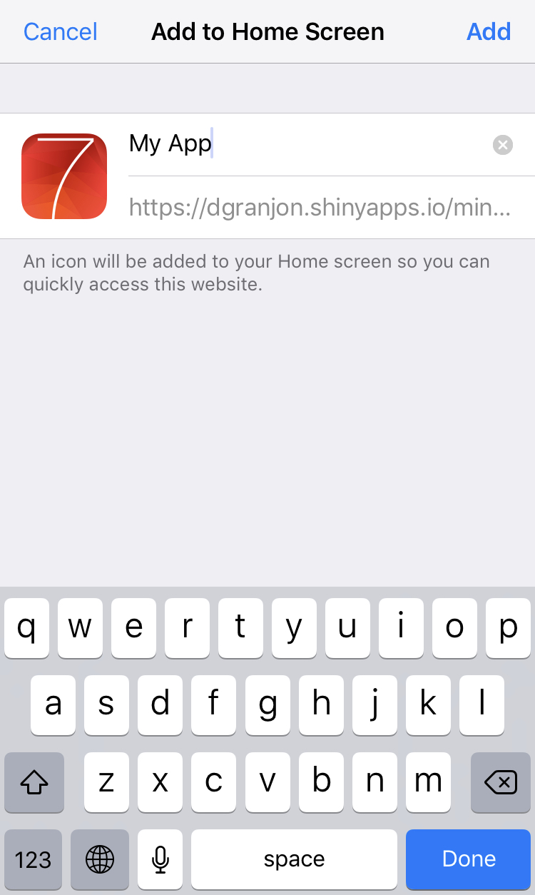

# shinyF7 
[](https://travis-ci.org/RinteRface/shinyF7)
[](https://ci.appveyor.com/project/RinteRface/shinyF7)
[](https://www.tidyverse.org/lifecycle/#maturing)
[](https://www.repostatus.org/#wip)
[](https://cran.r-project.org/package=shinyF7)

> shiny API for Framework7 (IOS/android)


## Installation

```r
# for the latest version
devtools::install_github("RinteRface/shinyF7")
```

## Demo

A running demo is on [shinyapps.io](https://dgranjon.shinyapps.io/miniUI2Demo/).
It is still work in progress and will significantly change!


## Progressive Web App (PWA)

### Configuration

shinyF7 is PWA capable, meaning that it can be displayed full screen on many mobile
devices. This feature is automatically handled by `f7Page()`: 

```r
shiny::tags$meta(name = "apple-mobile-web-app-capable", content = "yes"),
shiny::tags$meta(name = "theme-color", content = "#2196f3"),
shiny::tags$meta(name = "apple-mobile-web-app-status-bar-style", content="black-translucent"),
shiny::tags$link(rel = "apple-touch-icon", href = "icons/apple-touch-icon.png"),
shiny::tags$link(rel = "icon", href = "icons/favicon.png"),
shiny::tags$link(rel = "manifest", href = "manifest.json"),
```


However to access launch
icons, splatch screens ... you must create a manifest.json file and an icon asset folder in the www folder of your app: more [here](https://github.com/RinteRface/shinyF7/tree/master/inst/examples/gallery).

The manifest.json file could be like:

```javascript
{
  "name": "My App",
  "short_name": "My App",
  "description": "My App",
  "lang": "en-US",
  "start_url": "https://dgranjon.shinyapps.io/miniUI2Demo/",
  "display": "standalone",
  "icons": [
    {
      "src": "icons/128x128.png",
      "sizes": "128x128",
      "type": "image/png"
    },
    {
      "src": "icons/144x144.png",
      "sizes": "144x144",
      "type": "image/png"
    },
    {
      "src": "icons/152x152.png",
      "sizes": "152x152",
      "type": "image/png"
    },
    {
      "src": "icons/192x192.png",
      "sizes": "192x192",
      "type": "image/png"
    },
    {
      "src": "icons/256x256.png",
      "sizes": "256x256",
      "type": "image/png"
    },
    {
      "src": "icons/512x512.png",
      "sizes": "512x512",
      "type": "image/png"
    }
  ]
}
```

Be sure to replace the `start_url` with your own url. Add also a custom name, even though this can be modified later when adding the PWA to your IOS apps. 

Later, there will be a dedicated function that will create the manifest.json file as well
as other necessary assets.

### Add the PWA to your desktop Apps
Go to the url of your app. In this example this is: https://dgranjon.shinyapps.io/miniUI2Demo/. It opens like a classic web app. Then,
select the share button located in the bottom bar of your Iphone/Ipad. 

<div class="row">
<div class="card">
<a href="#" target="_blank"></a>
</div>
</div>

Click on "Add to Home Screen", choose a relevant name and click on OK. 

<div class="row">
<div class="col-sm-6" align="center">
<div class="card">
<a href="#" target="_blank"></a>
</div>
</div>
<div class="col-sm-6" align="center">
<div class="card">
<a href="#" target="_blank"></a>
</div>
</div>
</div>

The app will be added to your IOS Apps. In case you want custom icons, replace the content of the www folder with your own.

<div class="row">
<div class="card">
<a href="#" target="_blank"></a>
</div>
</div>


