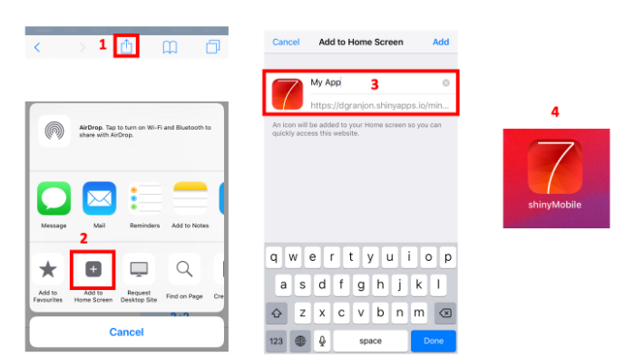

# shinyMobile 


> Develop outstanding {shiny} apps for iOS and Android, as well as beautiful {shiny} gadgets. {shinyMobile} is built on top of the latest [Framework7](https://framework7.io) template.

[](https://github.com/RinteRface/shinyMobile/actions)
[](https://lifecycle.r-lib.org/articles/stages.html)
[](https://cran.r-project.org/package=shinyMobile)
[](https://app.codecov.io/gh/RinteRface/shinyMobile?branch=master)


## Installation

```r
# from CRAN
install.packages("shinyMobile")

# for the latest version
devtools::install_github("RinteRface/shinyMobile")
```

## Demo

A running demo is available [here](https://shinylive.io/r/app/#h=0&code=NobwRAdghgtgpmAXGKAHVA6ASmANGAYwHsIAXOMpMAdzgCMAnRRAVwhiLdIAoAdMAPQsAzgwEAbAJZ0BWCdIZQGATwHCAFpIjKAskTqTxcfgEpeEcwRGkiMAPpbhpKOPEACADwBaNwDM2BKSSJG7cqFAEANZQAOZwwrhuDHCoRMJuALxuAHIAqgAy+YlavkSZOQVFblJ05XmFiQCOLJJwpOUAYgCC+QDKAKKJ5m4jbhxc5QAqWLn9Jm7mIMOjkr6hksIYECyu3DUm80sQoyfV0p4+GDUAClCk6sLcJsDAAIwAuu-LIwC+326rdabba7ZKpYQHNxHU6jMFpC5uOKkADyqCCJD4NHoDDsqEiMTscOEpn+f2OowAbnAGAj+AAWDAMgAM-H+VJp3kRwhYdExvH5vAwwAAehh3gBqAAk-CGYBlbnZZnJIyJCJi3N5-AE0rwCzluqJSpOxDIDHOnOEqDNZF8mIApMIBAYIAI4DBhAQzWiKAITaQzTIHfKiUNladFf8-QG1RrMXCMAwvNQoMIYBgiAwYk6tK73Z7JN6XVHpAIGQBmeX-E78eOJ5Op9OZ7Mut0er3kIskf0l8sYCu64t0UMwka+SQADzgABMpjM5v9AdwNlsduIlxBSpDoSOSmVOSwguJhMwoBSoIYoHQjBhwlFYvFuIOWAx3FlB0bRmSTlOUul9xApCcbgbCII9mFvaI4jsH9UAoH8IAIVpHgg+8EgBDciBMYcRxEOAtlgeJOh6AYPxGGC-x8NhJGaOBuHI0i-AzUIYPQtx6KhKsVjWPYKBie5uDHCApxvCJINomCmhaNpZ1mA5Dk4mEIDgcdSAUtwvx3CAnBcNcJKSFI0mKDDEhqSTWlIRJxjIBiNNHJiwnxViULiCEOLDE5FyMCA+PUAStGE5zaLxGIzOkrJplkrc1JOJSVLU2zTkXABCYK3DtLQ7SSIhqGgeBHl3KL3JHZMGAgLQYjCFNyExLA4BopxpzcQL5WC2UICIdpSjYGctDcWg6CwNxnSUZR9NSDBTAYkc3Fi1Sit+NS4QRXdgFavVavBSQbBUfgvnmsa9x8WN+DHIxEErfVEjhRIx0nGdwrnKbRmCux2WWjDVvxWUADVqWEYILDAPbpuS5pzPmaLRjy4R70qhrMQAEWygCiCgKdyr6+hBsC87dWCg41MXKzSHk-aTn9ZQAGE7gIXzt2mmF+qYZhHGcVxXt8YQHBgWHrrOIcmq+wWCQjMnP0SakGCYrJ-AQ9EIEfITSYZnduKSmIwTXfhcmgK84DcGw2OR8RUaneUTXR+WdHiGG4kVqc5LclXpqcIhUHtp6VYS530O09nSBiAAvbg+dM4XEhe0WfZ+T31LUuAj31+mGdZnS7AD4PQ+kCOhcj6lY4ShKtApDZpCMbh6nyJUyUsaxbAcLS2a18l+A0LRdH0QxjDwZZVTfTF1FIUhUGPAQBGtcgGF8CI8JiLb1B5DBgnHrRJ+ngg4CTFMYC8T0oBdC7B+H0fx4MhMt4bDMYhJCAlXMGpFBUbg2+0JUH5G5-NG0PQDCMO+IAAMRuGEJwBgG8xhECnDseI5h9acgoCXKW7AKA8CVOEe4CJhDKAammU6tF+DKVgKgIwjoYg6WpKoZwdBHQtVEvecorcv4d1-t3JUMN0DiGUHwckgFSAYDwY8f46D1C4AXAhcQLAfwYHRgwdIWRuh9EGEIu4k9jhZH4NgGUC4YjtWSBgAgKZ9YPVmMsLCyxZaBABgJZWowQHPg3n5a8wjKr3BulhaoRADGvjcHAD8ZJ-5oFQHYN28sKJnCAsse4bojF6hgGbHu5IpxKEiDJJR5JTpGHum4BRAxRHkitAnU21JUl5JGMQE2NJ1FgAAUyJkAB2KAvhfBaPJNACkdAlDlF4dwk4mgfzIggLcOIvRPSgW8RFNJJw4mUxQdSSYW0jCpNMeYf+QCX6jUCeYdZXR0A9LcC0covg6lDPwWGHS2VrgAHUuglP+CEgGci3CBOCWiB5pTRhHMmJefIUBlCcB4JxIIpBFlVPWT-LubgADi5CdoJJhNDe8HTKl+DqdbYQts4AACElDrlQAeAAklk-gMBlAIriEilpPsqUjmITPdQoEfzIv4GijFph3knHCEpI85RnAxHyBsAF+0jm3C5XskGRKwCcoTvkOAvhVJwoZkCkFeoZVyrcCKhOlKGb-R-AwsARg5VaumkczFJsoiYhuVK9w1B55NREOoHxTS4CBDZZDYV+8E7W22GKlOWkwpuAmeyhm-ypBKVuWLEYQDcjCH1ltVsTz0hUJmqeSQZD5ZuBIJwyGo5jkevEPi8gMAfUqyodkAieqqExtIF4fFEA8WkGJAqn2SqYn8FrfWg2l5G1BpVpIE0hy6n4pNJicQSg4iITAUYOwGS7AToIEYV1EbRgRCCFSJZS6zFLvdVygtbpi2KsvGW+AFau1tC8N0TF3bs2jBbXqzFB4bBaU7dQo1zs+0hBloO4d-BR2ZmdZISdcBp2GHELOgD87WHXtjiMTdKtZW+Gde0KpeKNCvphPckgjzunCBtbBVJsdYMjm3Qnfd5MFmtrAFgVNg91V5rQ6cHVFGzQxEHvRk4RysBo2CKRxKdaCUSqifANjpxR10ATnqyY6honCeNPSvthF+7EvibKYIjbCMqxjUYQIjUsjPIw1pSUgnjBi3U0RupnH0ZEB4x5PjpBCV6qSQwSIMnRiifE1UvQP4XNlLkxvR5BBMSOec7qH91H5WmZdgnRDOmAQIcTtwPTrzMOSiC7KILF0pAsfC5DCLpwONcas9erQ9b7NVPKRmbz1RLzub1JTUCFWm0M1pkQeTjykQdDqXVipjxcswk09FiVVpJA81hTlntpx4OIb1b4E2dxyouf01hgVz9cMxImQRziuW2lIoHWW9pOK1K3tBUw8FizoWuAocJ9Q54XxaDW3OcbIwDWkA1eMh7i0wuvfXTCXLRz8hEDngrQmEqTaA5OcJo7eoACanB9I6VGvcLQKS-ksDcAY44MQyhSeSAAfmE6UDqxSqmSY2MAxDANgHDZ2HcQi+8nkHik2QPtc2QhWk8TbDAAbsfGZBukFdLB4czTKLhGk+8ZzhHRdQDMM4klUMMZz64B4+rXfIG9FHfV97tDoAeNSU4SAAHJ2hGFPPrK8+9IhJWE9pBgKJYJqOycRfom3xtAOSMQN6US0f1ZpKgPtkRinFaV2L-ZqBZf609+QFSQ1RIa04EJTiQDyui4IMQBg6NvKcImkVXlwhJRtgLIK6a-BJQCQCPLJ4TsGa9CYRgNGU5KZ1xgCy+8AAJMXRgGDcEN8patSf9c3TL1YslvjK8qxL-rgBSfrh++pN9Fw+uTD6PRV3jpURY-dV3t7-vYwbb3hMAAbkhjHQ-FgxZjwNgDmIizh-R5pB0mNM4Qie6sAwZIZBOFk60+QGcVDIbV-brXlOPXo3s3nEG3kJB3l3jYDEFfnAKAfQEoNvhYuXsPjYr2txDfhkFgW4PrrTHcAvqPs7OPgAiSsPkigvhgBoNlE8CftSuPhgCBOIEigwd8kjsIBQX0rRAftej8D4onIQWPl3iQaSrvuSogYvpwTQdeiMPQYwcwVQvyhAJEOwYvlQdQFIUut7KcMfvFNwftKyEVL9nUl8tQjxpIAJqevKo9k8mVDzN-kRIotYThgWHAJeMqoGodpeO2geAkJ4XQJiqQFpNYVQtTGnr4ftAoQKuEdNFQpMD3sEV4cZH4ciFErIptv8B+IRjGgwG9DLIPhiIHhZBmgePWokDGuigDKTP8EAiwKHjTgbFJkJmGPoNkVSP0FSGQLigeIZo0XAMUDohmHALWltCUgISHmHh1jsu7GpItl0stpDEZuUIUT0dJvtE9DZP-CcDUXUeQBAl5s0dQtSG0R0TwMsalgCAMckMMUhgGg9mMbURMXUlMTxrMVkN0pDEFksXFjGl0aQClskpkFUulrqIGg7oohtoYaSJsaMNsWHl7hUncocTkXAO0Sgr8ZKEnv0bokMWVDcaCcnCMA8TTpMbsjMUlk+m8fMWLEnksbZhid7mpOsVCeYNUehB2meFILLgDIia0bRASQqC4OYcSYOrZr8aVnqJHlYehKUHqpcirnAOyDfDCByUKeQB1t4YXppCVoNimDhtLsJugqonqsAEyF4AAJzvAABUwmks0seoAyH+2wMAYmsiTUxuMalucokJYYMcLJYYQC0BsBO+6K9CSKiAwC9KOwj+AEo0YmbEGwo6ygjU1AjOGaxwnuw+ial4PJRxKJJx6JlabQiQ-J5R-0JAeecEDersTeohtEpAygeGVSgZRg8BFKuoyxhZJMnEpZAMFZQkVZNgNZIZds9ZjZEpl+RgvQrhYC6gbZRk9ahmlhGxfpWx+y2RZOQkM0cA1AwZrKBxvJqJnRhRLwxKIhw5CBiYMa8eQM7wxZnERJapqKtZgi+05heqpBz5wm7xYsRy8B1mN6PetJC5H555SK1hMU5aVSCMKaym16o5FGV5Vh16UmaMROeo8BbgLerhjKlWBOk8eqGFHQRAhODAlWkpWFqFTKYAcRUeFFOFjWMRPeRFJFFagFzFk8lWp4dwnSVSR8I8iAY8BAU4EA-Cig8AUuTmdSS8RAAgtKG89K4gjKslcAbsRgXgrwtS44GlppUlAAVqgNfF6SrBCT9syafqudPP7hfvpBvJIGuooEJLYLuahDmcidwPycXIKWHj8pPNwAAKy1JMhPS5SEScgBb8DfR9rbQXQABSRA6ggMwV5aFoRC5cIVaErw0JJwD5cAHW8BL54q75Z5GKV6+035Ksv5tZ-5IwkpBFtZlWIV5QIV4FN6DZTGzqcAdl04nFZ4zgVFfFJ8QlIlvgYl25GYkQUly8clcAClSlsEqlm82lWltS5pGA+lhlOWjJ6RPpWVbgAZzGcQNIpQNIoOWg-w3YMBxSnIyQK6XV7lnEyQjQBZlhgJeoeB2WO1rJp1xwvJNIHAUCC6YYf2AOWgU5yJnenEb5VS314ODFFx2J1x4aMIF1h1PKB11IGRK5ow-yC5-0xw11cE1I1wJsPAxCHUz8WgiQXgvuiQAATG4JaU1JIATM0SUd0cQGEm-oysTeTWTTwBzVTTTW4PTYzb7izXcmzX8bVQTUJETRPAWT3gxDjd0RLnqWngiFzXLavOiarRJQ7BLcPN0ZKUoK4RrYTQwNcPLR2T3ibVAErZLXnpyVdT4JrRbVbXScIE7QwBqfbYbX8Z7eYdSJxt5HAi7ebZbdrcsQHYysHXED7QbbjeQOgM7fpLLW7ZHR7UnbBAwL7QubTM6ikjLdze7XnVJlELnezWXfiFLLUWbWnRHUeXSfnWvjXagBXX8c3dXZwKgPTUXVrY3aXQXevj3e3ZKIoJZnXcXRnQuePcEKPbPUQL3WHfXSXd0QvbTaPc2aHanVPQPUbROb4gnd0f1oEJPf3acR7VFoEKPamEoKQLLlAGfQwCYeXJxPySMChVONwDAKQAYrIsAIkOFWADAAZfKFHSNg2gnO4lOFLKgA4QMO8E9D8ONlLDlARI8hMpjazX7f8ari4E-Q3RfcBcoGHr7lEPnEfX8VAAeJ4rYMQm0Aqfg33enXvX8SStQzYMQCA0YOQLtaOhwlwq8IgK8LTQPnLFYszWMcraQC8BLuQEyHGDAu2SYJ8E-TRaTVVHAAo-wPekPCQGA7KACOkGA7ZrI5o9o2AHQIEWAyo4g8udgwuWQ-7jkUw8vYyuo+iSSk4xQw4+zd7tPuQwwHPu4Mw4Q548oEnt4wwJKFJuOLtWsnBA0frDSVE2yUrobDFb0K5ccWicsSSpEzPgwHeUVD2eWVecAdWX+fBaxSpJvgibqJgWk2wxE97lEzE8pPY1jZGk1G7LUZQ5KKkHiqgHVmQCggQ6vX8YM7Ueo7tS0bmYeUQ-vTAUYNcL06gMUzCMKms2YYNms68BDuRgRaNGOLIu0FM6gPjnUqap4pEP+dMWAKs0M2jnTihg6p7iXNuUNDNf5JzpiqND+NPDsO0CMddukJNqfZmqNCmRQNevrjDAhl4LbV4I4GejYKgPrkYxAskA0XToHNSGUEuMiL0H4KuG2HABQJjB0ugBmjSJIES17mnkQGeE8ugGYGAL1h8sYT3mKbs0M+o5ViJtVt4vwI87XX6CggKycBySwBRiTukKTiSn4ABk4D00M4kPisArQEoJ6RyyMOyB0kEDAOo8iJLZiOcyMx2B9dNEyZ9eZdjUiTk6wwM3sxs4lNxB2S9dgSK2s2pmMSMOc70M4KQCIMtO63Sec5lXqG7BQN1WAHwTGm9SbA-gYcasYajBEmLJtOmk2W7C5rVVkHI-gg82s0Yy1Gs4G3cCICZdoWZayRoOS2cyTf0-W20Dze0KEyTfdUVJoEBKVBmEWlHVJm0MiNQizScL6XayMHM8iQswWQfdXg2669lTsblXUgu20EuBKi26QPs+y7W-6ULkEGOAYqEv8Pw8QoI4gGWGI5YgUWgfawefmceatOY5iJjtkB1KsDY58Eu4lP2pyIuJIGlJlPTdgUFSikOhiPwHQKBKQMBq4KYPG-rJXF03lnUh+0e-+fmxKfEEhWLO+vbgRy1ZDoW5iBh6sMzvLDYy1RqJDvwDcrR+Rnm+RlRlluo0sVtUVBO+O-E24AjJIC4ADsSAe+1Ee5Rw8me4EpwtwEI9eyS+I3e1Iw63mbk6Yy+w1BY5jvx4J4ZcULY7+x5O669ZG+-Zy9p6DtVQbIc1BQJ6DlZ8Ct3C1TVYBcTj25i3Ti4NSO0OjDpymwzAXEh7FusK9RvX62Z7ZwDpZ1DW9SQCczAOZwDmRdZ3qAlzEPZwunDcjW1XqiaHF2RS53qHK+58cLlwBjAPGb50Zf5-FIF4B69WWPe5s3Uql1F4NlLCA6QKl0lw53qql+l453Bdl8hu12iPl1Hq56TqTo-Wzh1xV6Dn59a-FJxNx5+LM8p7O8saVwwPFxFyFGMZ8umzwNh6R-Rx3sC7ZkY7jPOX4xuGV6l2O6t6h9IwMyN-6KFW49SLkPil2zCIB8CKuDra9-d415y9c1EPMg58BMl-wJTFIFEGmXNwDkNA+iEP2Eg5xCamapEBD+XJDssTN2iPd-u6uYM0y39Nkyp066T+yLo4+gZ08kAR1o82TxDa+byyz7T-o5lxmuSUtkBOK2QBJm51Nyipz4ldtTx6hwGYd8JycNO464s1LYd-Twd1VDxlmxTlUjB3ozABDgV22k8uV4-TYFVJzv0HcDvp6RL495O3tU8rez9UO3NHL+t0+3SZjl0A7+u0UfyUcp7-LN7zxhrNFx4Wz3qrdSQLu9YdrnoxSeEpqdNOVc7Nh-wOR8eyzoDE5wCP2p+pB0DmALuIuj7DSVkChyZi1UnyWvr2AF19zx5DnxB9+vqmFtrkwfB+IEX87CXxUIUJtWsdb78Gt4+6pwuRHxAK8HYDH3T2MYB3SWPxP1Px+lkCZ2pEcmn1h9XzDqjvOjPtGUk0q6c8j7Hy5gRwOnn5iDB+IHBxkp3zEdD2AGn+J1z8Ryx2Fux1Uu1NQAt6cEg7V2G6Pw7wX4o81EWQULqZyOQtdIY0XfgGP29618X+PXKpLDz9w75rKo6AIA6kfqTBDunpYjkNxi63dtuebTfrDh37kM9+nuGNBbCP6Ppv+JwdHrawp4bcPaq2f3gDEn7AD6es-XGqwId4cDY+xnEHjmnX4LESB2-OHv7goFSYD+KrRfpnygEN8jk5-aDrB3b638RwdHB-p+3T5Uc6+-XVjoPHf56hP+dA0YL-wTgJtuBx9XgfLH4GPoQuQglFJAPw4SpYBTveAQsXv7ID4ex6Q2OgIQiYCA0OAvNvgP4BbddeeglPmAC35o4JBjUJ-NIKoEkAZwcg0wTBmW7E8H28zN3gAID7uDduKvNNmr2O6aMLUZ3JppdxMa5CAYcA3bg90H5S9xi9RNnBrBti34mBOQ7ojlQMqvB6eOVJnlLFaHL5oBkqGIFHwFISIYkyxboWMM6YHscqiIahnEA6Ej8uhK7MhCwDiC9D7iK7DrNCk2G0QRhJKDYVsPlDSsphdJHKicLgCZVMh3TZSJyhnB-0ZwFYfctkNWF-FMcoRKcH0N2GdYlAX9EYc8LR53C7eW9e3qnksy295elPRXpKA94p5pcAMX4Y8U96QirEwOcPoiLTwAwo+akE+vYWX4D91IvHBYVahWFOtMcr2FEcKVeybs9UVqVVFaxt51tVs-yCkXCOcKwQ0+hQkQREWr7kAnAwmU-rnyb6X9r+IGdQWRkQF6hH+J7bktz0Y4yj6OwCHkC2gOYOcDBpAIwfwBMFVd6BoImEcwJ4EuEugZ3Qoc4Lv7Kia+u3frnr3G6FdhefOY4J5xtyI8Nq3pSXtCNd4fC88NgmoU70KFsCSAgfNSMHyySh9CqoKf0c-zUhyC+eCfEcJX0VTV85RGfSrCKMb5QcC+GEKUSOG75l9jKFfKks2mr4eCl0mYpQU30yyDxW+dANQeyyz4FjKgffRbp6JZEHsCks2RlLLyyEztOh-telNQH+yUV6eahAYYUkorAQx0-qfgAAi7FFILaTbAcN7j1RXgZWSpU4L0GwSUEjAKQbgBvU4icEJx3Y6kNOL-Q3E5xC4yim203ENDfGkzZIKeKXEdQCGnbfkj2x4B9ttuMnWpPUJJGNDUA9KQ2IwGyjZEORc7ZZnAGuDASiAhQmCR1CICYpUG2RHjIsSBLJIIcoQsANpCEiCclIBpWCf5n-L8ABqAlX0MJVEoEQJKE1aSrJVHTyUGU1INQKkBtzCB1KTIWmnSGWpcT1Ka1UBnoNIlDx+KglSiSNWonjVJqMlaarNWYmWgMwDaDiVxJ4l0gvAtNfibp0hhCTj45EoalRPEqSS6JMkpiWIHklsSlJ3EjSrxLLAaS0hbgG1l6NZJeoRAEEjsgfWck0jHyzkhGLAz1w5RMQ8AbYLuzmEu9h+TrQKSwF3QwBthvvdDtoOAjV9LkCcdwHriUg6tQRayf3Dw30ZvC3KHlCACqW8o05O8dIQKk9COS9AspbQbMZQSqmPovAvCC6NPC8y6hDxjAg9pMGSAKlWgX-B8YZi6kfMdyzDDxvlIXJvdup25DKQGjcI85saDtKhIsmYZfcfuaHF+rRB-p-1hAbwYRn5VwCIMppeKVwNZWSAjV4g6gVkkaIHEDN-Qv7ABKyX9b+gK2wbMJFYMmb+gIYYALntUXulODduPqIBOTAK6kd9caIWluwQjiPSg2VbINADNapjkYBZ3b-rDIYhAIVu-icwGAB+DvAgAA).

## Sponsors

`{shinyMobile}` is supported/funded by [AthlyticZ](https://linktr.ee/athlyticz).


AthlyticZ offers top notch Shiny courses developed by [Veerle van Leemput](https://hypebright.nl/):

- Productionizing Shiny Applications [course](https://athlyticz.com/shiny-ii).
- Outstanding InterfaceZ with Shiny [course](https://athlyticz.com/shiny-iii).
- More to come ...

## Progressive Web App (PWA)

### Configuration

`{shinyMobile}` is PWA capable, meaning that you can make sure your app uses the correct assets to be used as a PWA. This feature is automatically handled by `f7Page()` if `allowPWA` is `TRUE`. 

<br>

When set to `TRUE`, your app is set up to use both a `service-worker.js` script and a `manifest.webmanifest` file that you will provide.

<br>

To create these necessary assets for your PWA, you can use `{charpente}`:

```r
remotes::install_github("RinteRface/charpente")
library(charpente)
set_pwa(APP_PATH, ...)
```

Where `APP_PATH` is the app location. Currently, it only works if the app is **inside a package** like with [`{golem}`](https://github.com/ThinkR-open/golem). If your app is not in a package, you may copy the `www` folder of the [gallery app](https://github.com/RinteRface/shinyMobile/tree/master/inst/examples/gallery/www), which provides:

- A valid `service-worker.js`.
- A valid web manifest (`manifest-webmanifest`). Don't forget to change the `start_url` property to the path of your app.
For instance, the following app hosted at https://dgranjon.shinyapps.io/rstudio-global-2021-calendar/, has the `/rstudio-global-2021-calendar/` path.
- As a bonus a valid `offline.html` fallback, which is displayed when the app is offline.
- A valid set of icons. There are tools such as [appsco](https://appsco.pe/developer/splash-screens) and [app-manifest](https://app-manifest.firebaseapp.com), to create 
those custom icons and splash screens, if you need to.

It is really easier with `{charpente}`, the reason why we strongly recommend to develop your app inside a package.

<br>

But that's not all that's needed! When you set `allowPWA = TRUE` in `f7Page()`, the app will also attach the [Google PWA compatibility script](https://github.com/GoogleChromeLabs/pwacompat), called PWACompat, which will help with PWA compatibility. More specifically, PWACompat brings the Web App Manifest to non-compliant browsers for better PWAs. This mostly means creating splash screens and icons for Mobile Safari, as well as supporting IE/Edge's Pinned Sites feature. It basically assures that the `manifest.webmanifest` file has a wider support.

### Using your PWA

The first step is to deploy your app somewhere. It doesn't matter where (shinyapps.io, Posit Connect, your own server, etc.), but you will need a URL to access it.

<br>

Then, you can follow these steps to install your app on your mobile device.

<br> 
Copy the URL of your app in your mobile web browser (iOS: Safari and Andoid: Chrome). In this example this is: https://dgranjon.shinyapps.io/miniUI2Demo/. It opens like a classic web app, with top and bottom ugly navigation bars that are part of the browser UI.

- Select the share button located in the bottom bar of your iPhone/iPad For Android, you may do something similar. Importantly, Chrome for iOS does not support this feature, that's why we recommend using Safari.
- Click on "Add to Home Screen"
- Choose a relevant name and click on OK. 
- The app will be added to your iOS/Android Apps. In case you want custom icons, replace the content of the www folder with your own.

<div class="row">
<div class="card">
<a href="#" target="_blank"></a>
</div>
</div>

### Limitations
It is actually quite complex to guarantee that all mobile platforms are supported.
The PWA compatibility script will work in most cases. If not, please open an issue [here](https://github.com/GoogleChromeLabs/pwacompat/issues), to help improving it!

## Acknowledgement

A special thanks to [Vladimir Kharlampidi](https://github.com/nolimits4web) for creating this
amazing framework7 HTML template.

## Code of Conduct
  
  Please note that the shinyMobile project is released with a [Contributor Code of Conduct](https://contributor-covenant.org/version/2/0/CODE_OF_CONDUCT.html). By contributing to this project, you agree to abide by its terms.
