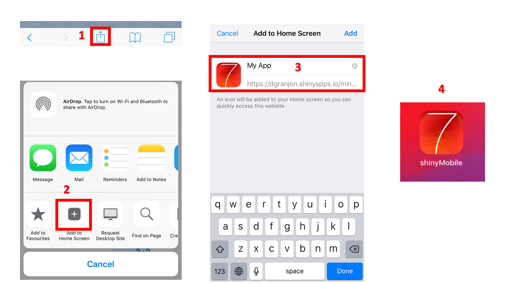

# shinyMobile 


> Develop outstanding {shiny} apps for iOS, Android, desktop as well as beautiful {shiny} gadgets. {shinyMobile} is built on top of the latest [Framework7](https://framework7.io) template.

[](https://github.com/RinteRface/shinyMobile/actions)
[](https://www.tidyverse.org/lifecycle/#maturing)
[](https://www.repostatus.org/#wip)
[](https://cran.r-project.org/package=shinyMobile)

## Installation

```r
# from CRAN
install.packages("shinyMobile")
# for the latest version
devtools::install_github("RinteRface/shinyMobile")
```


## Cheatsheet

<a href="https://github.com/RinteRface/cheatsheets/tree/master/shinyMobile"></a>


## Demo

A running demo is on [shinyapps.io](https://dgranjon.shinyapps.io/miniUI2Demo/).
Left side: android demo, right side: iOS demo

<div class="marvel-device note8" style="margin: 10px;">
    <div class="inner"></div>
    <div class="overflow">
        <div class="shadow"></div>
    </div>
    <div class="speaker"></div>
    <div class="sensors"></div>
    <div class="more-sensors"></div>
    <div class="sleep"></div>
    <div class="volume"></div>
    <div class="camera"></div>
    <div class="screen">
        <!-- Content goes here -->
        <iframe width="100%" src="https://dgranjon.shinyapps.io/miniUI2DemoMd" allowfullscreen="" frameborder="0" scrolling="no" height="822px"></iframe>
    </div>
</div>

<div class="marvel-device iphone-x" style="margin: 10px;">
  <!--<div class="notch">
    <div class="camera"></div>
    <div class="speaker"></div> 
  </div> -->
  <div class="top-bar"></div>
  <div class="sleep"></div>
  <div class="bottom-bar"></div>
  <div class="volume"></div>
  <div class="overflow">
    <div class="shadow shadow--tr"></div>
    <div class="shadow shadow--tl"></div>
    <div class="shadow shadow--br"></div>
    <div class="shadow shadow--bl"></div>
  </div>
  <div class="inner-shadow"></div>
  <div class="screen">
    <!-- Content goes here -->
    <iframe width="100%" src="https://dgranjon.shinyapps.io/miniUI2Demo" allowfullscreen="" frameborder="0" scrolling="no" height="710px"></iframe>
  </div>
</div>


## Progressive Web App (PWA)

### Configuration

shinyMobile is PWA capable, meaning that it can be displayed full screen on many mobile
devices. This feature is automatically handled by `f7Page()` and the Google PWA compatibility
[script](https://github.com/GoogleChromeLabs/pwacompat). The last 3 parameters of `f7Page()`
are not mandatory. If not provided, the app will use shinyMobile default ressources to create an apple-touch-icon, a manifest and a favicon. The PWA compatibility script will automatically create any missing icons and splash screens for iOS and Android devices.


Below is an example showing the manifest.json file:

```javascript
{
  "name": "My App",
  "short_name": "My App",
  "description": "My App",
  "lang": "en-US",
  "start_url": "https://dgranjon.shinyapps.io/miniUI2Demo/",
  "display": "standalone",
  "icons": [
    {
      "src": "icons/128x128.png",
      "sizes": "128x128",
      "type": "image/png"
    },
    {
      "src": "icons/144x144.png",
      "sizes": "144x144",
      "type": "image/png"
    },
    {
      "src": "icons/152x152.png",
      "sizes": "152x152",
      "type": "image/png"
    },
    {
      "src": "icons/192x192.png",
      "sizes": "192x192",
      "type": "image/png"
    },
    {
      "src": "icons/256x256.png",
      "sizes": "256x256",
      "type": "image/png"
    },
    {
      "src": "icons/512x512.png",
      "sizes": "512x512",
      "type": "image/png"
    }
  ]
}
```

Be sure to replace the `start_url` with your own url. Also, add a custom name, even though this can be modified later when adding the PWA to your IOS apps. shinyMobile has an helper to create the manifest, that is
`create_manifest`. FInally, there are tools such as [appsco](https://appsco.pe/developer/splash-screens) and [app-manifest](https://app-manifest.firebaseapp.com), to create 
those custom icons and splash screens, if you need to.


### Add the PWA to your desktop Apps

Copy the url of your app in your mobile web browser (iOS: Safari and Andoid: Chrome). In this example this is: https://dgranjon.shinyapps.io/miniUI2Demo/. It opens like a classic web app, with top and bottom ugly navigation bars.

- Select the share button located in the bottom bar of your Iphone/Ipad. For Android,
you may do something similar. Importantly, Chrome for iOS does not support this feature, that's why I recommend using Safari.
- Click on "Add to Home Screen"
- Choose a relevant name and click on OK. 
- The app will be added to your IOS/Android Apps. In case you want custom icons, replace the content of the www folder with your own.

<div class="row">
<div class="card">
<a href="#" target="_blank"></a>
</div>
</div>

### Limitations
It is actually quite complex to guarantee that all mobile platforms are supported.
The PWA compatibility script will work in most of the case. If not, please open an issue [here](https://github.com/GoogleChromeLabs/pwacompat/issues), to help improving it!


## Acknowledgement

A special thanks to [Vladimir Kharlampidi](https://github.com/nolimits4web) for creating this
amazing framework7 HTML template.


## Code of Conduct
  
  Please note that the shinyMobile project is released with a [Contributor Code of Conduct](https://contributor-covenant.org/version/2/0/CODE_OF_CONDUCT.html). By contributing to this project, you agree to abide by its terms.
