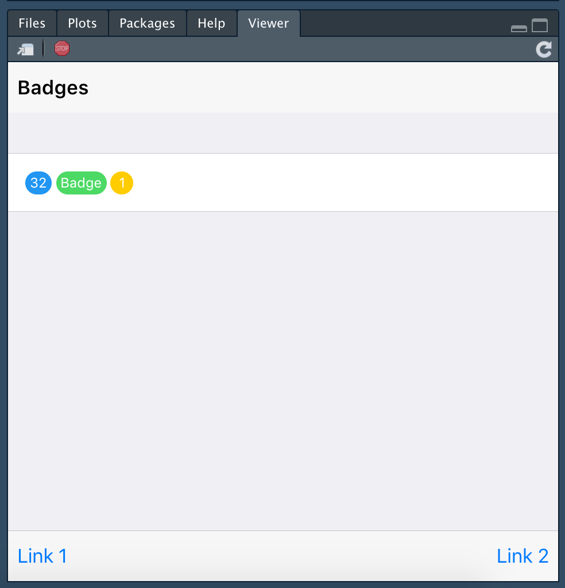
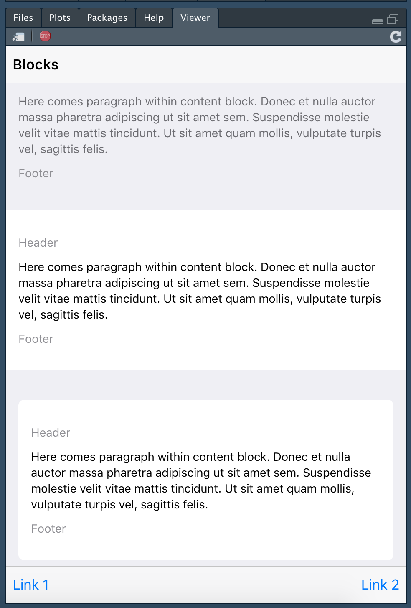
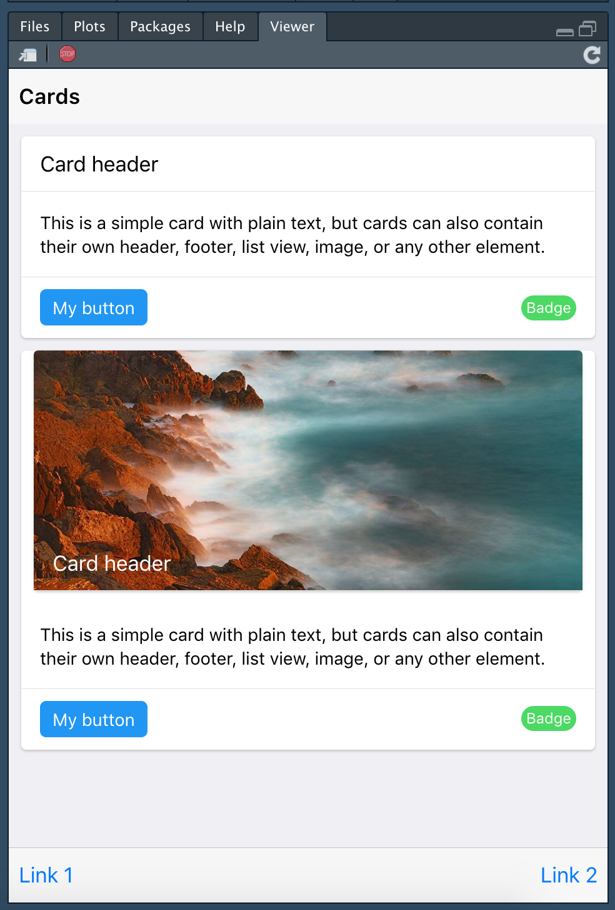
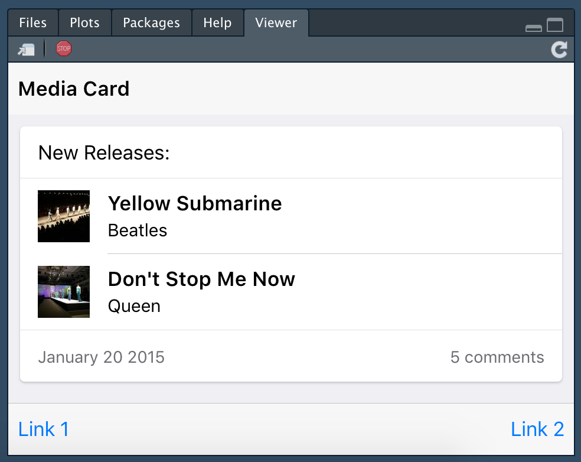
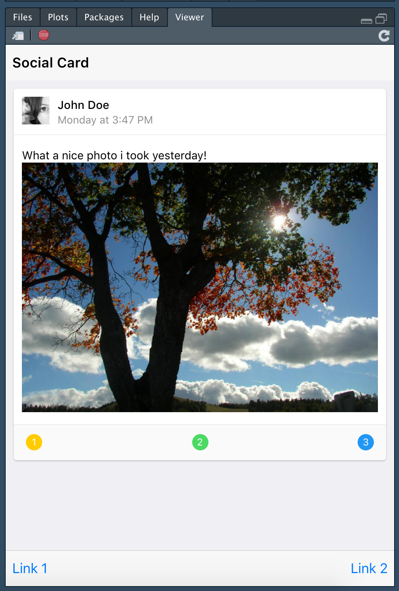
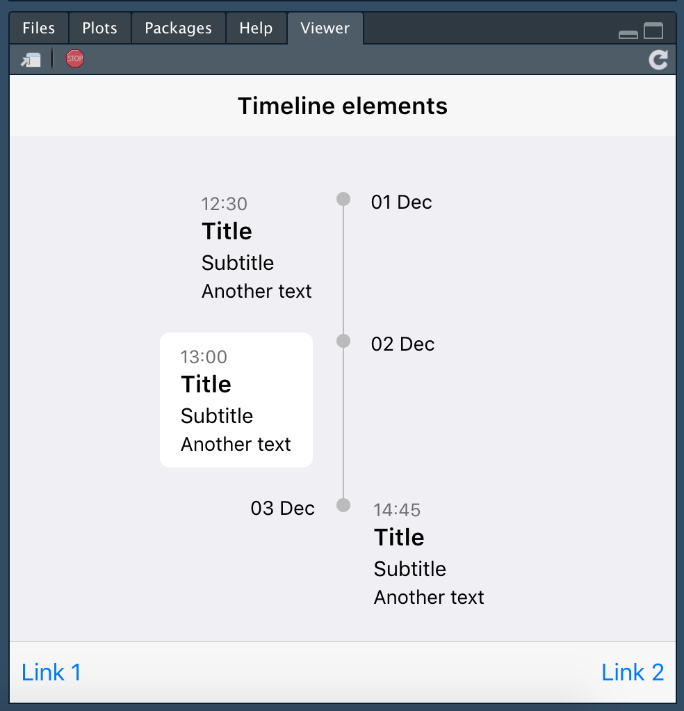

Below is a list of almost all f7 elements.

## Accordions

## Badges

## Progress bars

## Blocks

## Cards

### Classic Cards

### Media Cards

### Social Cards

## Segments

## Timelime

## Sheets

## FABs

## See more in the package help 
