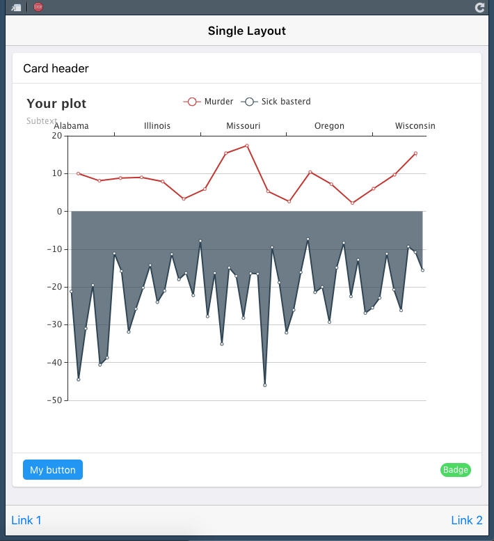

shinyF7 comes with 2 predefined layouts. `f7SingleLayout()` is dedicated to build simple, 
one-page apps or gadgets.

<a href="https://dgranjon.shinyapps.io/miniUI2Single" target="_blank"></a>


```r
library(shiny)
library(shinyF7)
library(echarts4r)

plot <- USArrests %>%
  dplyr::mutate(
    State = row.names(.),
    Rape = -Rape
  ) %>%
  e_charts(State) %>%
  e_line(Murder) %>%
  e_area(Rape, name = "Sick basterd", x_index = 1) %>%  # second y axis
  e_title("Your plot", "Subtext", sublink = "https://john-coene.com") %>%
  e_x_axis(1, show = FALSE) # hide scond X Axis

shiny::shinyApp(
  ui = f7Page(
    title = "My app",
    dark_mode = FALSE,
    f7Init(theme = "ios"),
    f7SingleLayout(
      navbar = f7Navbar(
        title = "Single Layout",
        hairline = TRUE,
        shadow = TRUE
      ),
      toolbar = f7Toolbar(
        position = "bottom",
        f7Link(label = "Link 1", src = "https://www.google.com"),
        f7Link(label = "Link 2", src = "https://www.google.com", external = TRUE)
      ),
      # main content
      f7Shadow(
        intensity = 16,
        hover = TRUE,
        f7Card(
          title = "Card header",
          plot,
          footer = tagList(
            f7Button(color = "blue", label = "My button", src = "https://www.google.com"),
            f7Badge("Badge", color = "green")
          )
        )
      )
    )
  ),
  server = function(input, output) {
    output$distPlot <- renderPlot({
      dist <- rnorm(input$obs)
      hist(dist)
    })
  }
)
```
