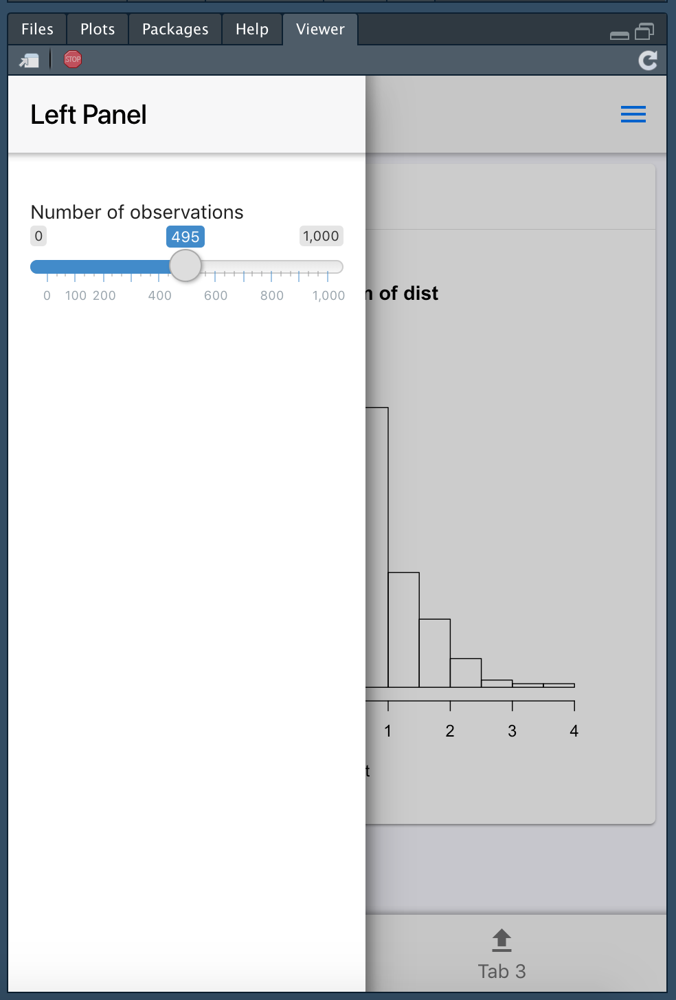

## Introduction

- shinyMobile is built on top of the latest [framework7](https://framework7.io) template (V5.1.1). It may be 
used for different purposes:

  * develop mobile-ready shinyapps
  * develop progressive web shinyapps (PWA, similar to native apps)
  * develop desktop shinyapps
  
### 3 Custom skins

- shinyMobile has 3 skins:

  * aurora for desktop apps
  * ios and md for mobile apps
  * auto automatically detect if the app is running with android or iOS and accordingly adapt 
the layout

It is possible to apply the iOS skin on android and inversely, even though not recommended.

- This package also provides 2 themes, namely light and dark. 


### 3 Layouts

- shinyMobile brings 3 out of the box layouts:

  * `f7SingleLayout`: develop simple shinyMobile Apps (best choice for iOS/android Apps)
  * `f7TabLayout`: develop complex multi tabbed Apps (best choice for iOS/android Apps)
  * `f7SplitLayout`: for tablets and desktop with a sidebar, navbar and a main panel


### New Inputs

- shinyMobile has its own custom input widgets with unique design for each skin (iOS/android/aurora):

  * f7Slider
  * f7Text
  * f7checkBox
  * f7checkBoxGroup
  * f7Radio
  * f7Toggle
  * f7Stepper: equivalent to `numericInput()` from {shiny}
  * f7Date: experimental
  * f7Picker
  * f7DatePicker
  * f7ColorPicker
  * f7Password
  * f7SmartSelect
  * f7Select
  * f7Button: similar to `actionButton()` from {shiny}
  * f7Fab: enhanced `f7Button()` with ability to be gathered in a `f7Fabs()` container
  
- It also has custom update functions to act on the server side:

  * updateF7Picker
  * updateF7Stepper
  * updateF7Toggle
  * updateF7Slider
  * updateF7Fab
  * updateF7Date
  * updateF7Text
  * updateF7Checkbox
  * more to come on a future release
  

- shinyMobile has custom input values for sidebar and tabs as well as dedicated update 
functions to act on the server side:
 
  * updateF7Tabs
  * more to come soon
  
- shinyMobile has custom input for sidebar (`f7Panel()`) as well as a serve side update function:

  * updateF7Panel
  
### Create your first App

#### Select a template
This choice is crucial when you are developing an App. It depends on the complexity
of your visualizations and content. If your plan is to develop a simple graph or table,
you should go for the `f7SingleLayout()` option. For more complex design, the best is
`f7TabLayout()`. `f7SplitLayout()` is specific for tablets and desktop apps.

#### Simple Layout

```r
f7SingleLayout(
  ..., 
  navbar, 
  toolbar = NULL, 
  panels = NULL,
  appbar = NULL
)
```

While only the navbar is mandatory, other components such as the toolbar are 
optionnal for the `f7SingleLayout()`. 


#### Tabs Layout

```r
f7TabLayout(
  ..., 
  navbar, 
  panels = NULL, 
  appbar = NULL
)
```
  
The ... argument requires `f7Tabs(..., id = NULL, swipeable = FALSE, animated = TRUE)`.
The id argument is mandatory if you want to exploit the `updateF7Tabs()` function.
`f7Tabs()` expect to have `f7Tab(..., tabName, icon = NULL, active = FALSE)` passed inside.


#### Split Layout (similar to sidebarLayout in {shiny})

```r
f7SplitLayout(.
  ..., 
  navbar, 
  sidebar, 
  toolbar = NULL, 
  panels = NULL,
  appbar = NULL
)
```

The main content goes in the ... parameter. Navigation items are gathered in the
sidebar slot. The sidebar expect a `f7Panel`. Importantly, the side parameter must
be set to "left" and the style to "reveal". The navigation menu is organized as follows:

```r
f7PanelMenu(
  id = "menu",
  f7PanelItem(
    tabName = "tab1", 
    title = "Tab 1", 
    icon = f7Icon("email"), 
    active = TRUE
  ),
  f7PanelItem(
    tabName = "tab2", 
    title = "Tab 2", 
    icon = f7Icon("home")
  )
)
```

The id argument is important if you want to get the currently selected item or
update the select tab. Each `f7PanelItem` has a mandatory tabName. The associated input
will be `input$menu` in that example, with "tab1" for value since the first tab was
set to an active state. To adequately link the body and the sidebar, you must wrap the
body content in `f7Items()` containing as many `f7Item()` as sidebar items. The tabName must
correspond!


#### Core Layout Components

#### Page
It is the main skeleton of the template.

```r
f7Page(
  ..., 
  init = f7Init(skin = "auto", theme = "light"),
  title = NULL, 
  preloader = FALSE, 
  loading_duration = 3
)
```

`f7Init()` is mandatory (see below) since it sets up the app. preloader is useful
in case you want to display a loading screen. `f7Page()` accepts any shinyMobile layout.

##### Navbar
The navbar is one of the most important element of any shinyMobile layout.
It contains a title, a subtitle, triggers for both right and left panels (`f7Panel()`) as well
as a subnavbar (`f7SubNavbar()`).

```r
f7Navbar(
  ..., 
  subNavbar = NULL, 
  title = NULL, 
  subtitle = NULL,
  hairline = TRUE, 
  shadow = TRUE, 
  bigger = FALSE,
  left_panel = FALSE, 
  right_panel = FALSE
)
```

For complex apps, it might be interesting to add a `f7SubNavbar(...)`. It may contain
any element like `f7Button()` or text. `f7Navbar()` has also styling parameters such as
shadow and hairline.


##### The Toolbar

This is an option if you decide not to embed a `f7SubNavbar()`. The toolbar is the
rigth place to add `f7Button()`, `f7Link()`, `f7Badge()`... Its position is controlled
with the position parameter (either top or bottom).

```r
f7Toolbar(
  ..., 
  position = c("top", "bottom"), 
  hairline = TRUE,
  shadow = TRUE, 
  icons = FALSE, 
  scrollable = FALSE
)
```

Interestingly, `f7Tabs()` is a custom `f7Toolbar()`!

##### Panels
Panels are also called sidebars. `f7Panel()` is the corresponding function.

```r
f7Panel(
  ..., 
  title = NULL, 
  side = c("left", "right"),
  theme = c("dark", "light"), 
  effect = c("reveal", "cover"),
  resizable = FALSE
)
```

Although the App has a theme parameter, `f7Panel()` has an independant theme option.
For instance, it is definitely possible to create a dark `f7Panel()` while the page
theme is light, and conversely. Its behaviour is controlled via the effect argument:
- "reveal" will make the body content move and resize
- "cover" will cover the body content
The resizable argument allows to dynamically resize the panel.

Note that for the moment, there is no option to control the width of each panel.
  
As stated previously for the `f7SplitLayout`, the `f7Panel()` may also be considered
as a sidebar. In that case, we may include `f7PanelMenu()`.
Finally do not forget to set up the `f7Navbar` so that panels are allowed!

<div class="row">
<div class="col-sm-4" align="center">

</div>
<div class="col-sm-4" align="center">

</div>
</div>


##### The appbar

`f7Appbar()` is displayed on top of the `f7Navbar()`. It is a best choice to embed
`f7Searchbar()`. `f7Appbar()` may also trigger `f7Panel()`. 

```r
f7Appbar(
  ..., 
  left_panel = FALSE, 
  right_panel = FALSE,
  maximizable = FALSE
)
```

#### App Initialization
This is probably the most inportant function of the template: `f7Init()`.
This functions helps to set up the template as well as properly initializing 
the main view of your app.

```r
f7Init(
  skin = c("ios", "md", "auto", "aurora"), 
  theme = c("dark", "light"), 
  filled = FALSE, 
  color = NULL, 
  tapHold = TRUE,
  iosTouchRipple = FALSE, 
  iosCenterTitle = TRUE, 
  hideNavOnPageScroll = TRUE,
  hideTabsOnPageScroll = FALSE, 
  serviceWorker = NULL
)
```

As stated above, you may choose between 3 skins and 2 color themes. There is a third option
called "filled" that allows to fill the navbar and toolbar if enabled. The color options simply
changes the color of elements such as buttons, panel triggers, tabs triggers, ... 
shinyMobile brings a lot of different colors. hideNavOnPageScroll and hideTabsOnPageScroll allow to hide/show the navbar and toolbar
which is useful to focus on the content. Note that the serviceWorker option is not working at the moment. The tapHold parameter ensure that the "long-press" feature is activated.
framework7 has more options which will be implemented in a next version of shinyMobile.


